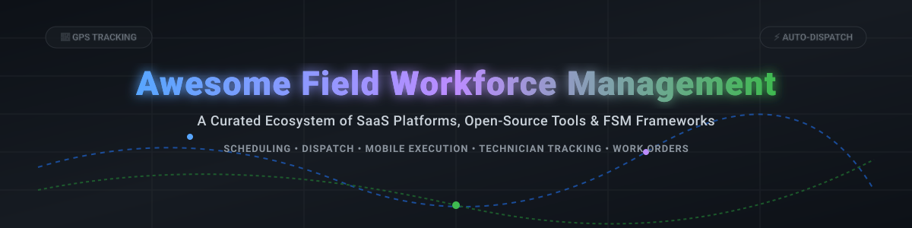
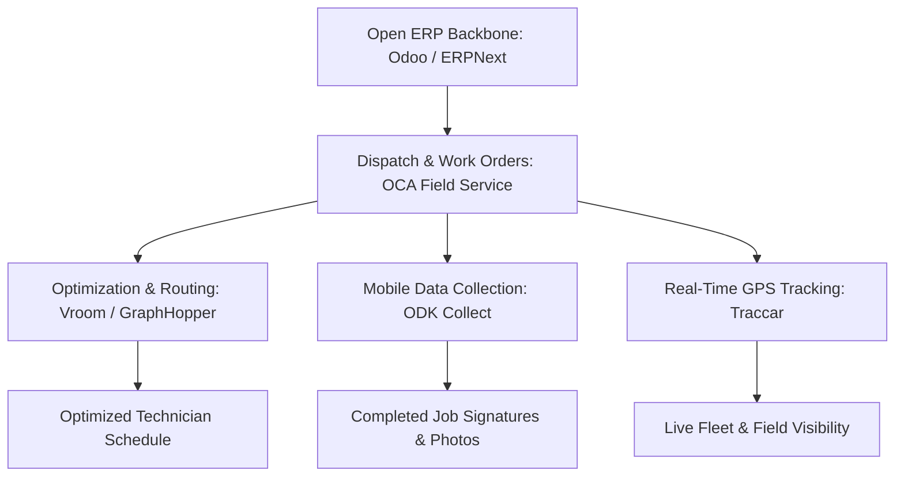

# Awesome Field Workforce Management 🛠️⚡

  

  
  
  
  
  

---

## 📌 Overview & Ecosystem

Welcome to the **Awesome Field Workforce Management (FSM)** repository! 🚀 This guide tracks leading **SaaS platforms** and **open-source GitHub projects** designed for workforce dispatch, mobile job execution, technician GPS tracking, automated scheduling, and field service operations.

Whether you are an enterprise operations lead looking for commercial software or a developer building custom FSM workflows using open-source frameworks, this curated list covers the entire software landscape.

---

## 📈 Market Overview & Insights

> **Market Size & Structure**: The global Field Service Management (FSM) market size is estimated at **~$4.5 Billion – $5.2 Billion (2025/2026)** and is projected to reach **>$9.5 Billion by 2030** (CAGR ~11.5%). 
> 
> **Market Fragmentation**: The market is **moderately fragmented**. Enterprise legacy & multi-billion dollar tech giants (Salesforce, Oracle, ServiceMax/PTC) capture large industrial and enterprise contracts, while specialized vertical SaaS solutions (ServiceTitan, Jobber, Housecall Pro) dominate SMB trades. Meanwhile, flexible open-source solutions (OCA Odoo, ERPNext) provide strong customization for mid-market businesses.

---

## ☁️ SaaS / Hosted Field Workforce Platforms

Below is a curated comparison of top commercial field service platforms, sorted by estimated company scale (revenue/valuation descending).

| Product 🏢 | Description 📝 | Scale / Revenue / Valuation 💰 | Starting Paid Price 💳 | Free Tier / Trial Limit ⏳ |
| :--- | :--- | :--- | :--- | :--- |
| **[Salesforce Field Service](https://www.salesforce.com/products/field-service/overview/)** | Enterprise FSM integrated into Salesforce CRM for field dispatch, asset management, and mobile worker alignment. | **~$34.9 Billion** (Parent Salesforce annual revenue) | **$50** / user / month (Field Service Contractor) | **30-day free trial** (Full sandbox trial) |
| **[Oracle Field Service](https://www.oracle.com/applications/customer-experience/service/field-service-management/)** | Cloud enterprise FSM with predictive routing and AI-driven field dispatch optimization. | **~$53.0 Billion** (Parent Oracle annual revenue) | **$100** / user / month (Enterprise tier starting rate) | **30-day free trial** (Oracle Cloud Free Tier + trial credit) |
| **[ServiceTitan](https://www.servicetitan.com/)** | All-in-one software platform for residential & commercial HVAC, plumbing, electrical, and field trades. | **~$9.5 Billion** (Valuation / IPO candidate; ~$600M ARR) | **$300** / month (Starter contractor package) | **No free tier** (Custom live demo & sandbox onboarding) |
| **[ServiceMax](https://www.servicemax.com/)** | Enterprise asset-centric field service platform focused on complex industrial equipment and medical devices. | **~$1.46 Billion** (Acquired by PTC for $1.46B) | **$65** / user / month | **14-day free trial** (Guided enterprise demo environment) |
| **[Jobber](https://getjobber.com/)** | Operations management platform for SMB home service businesses—quoting, dispatch, and invoicing. | **~$800 Million** (Valuation; >$100M ARR) | **$49** / month (Core plan, 1 user) | **14-day free trial** (Full feature access, no credit card required) |
| **[Housecall Pro](https://www.housecallpro.com/)** | Comprehensive field app for service professionals, trades contractors, scheduling, and payment processing. | **~$600 Million** (Valuation; >$80M ARR) | **$49** / month (Basic plan, 1 user) | **14-day free trial** (Full feature access) |
| **[WorkWave](https://www.workwave.com/)** | Field service and route management suite used for scheduling, fleet tracking, and field coordination. | **~$300 Million** (Annual Revenue) | **$54** / user / month | **14-day free trial** (Interactive product demo & trial) |
| **[Skedulo](https://www.skedulo.com/)** | Intelligent mobile workforce management & scheduling software for deskless workers in healthcare & utilities. | **~$100 Million** (Valuation; ~$35M ARR) | **$79** / user / month (Standard deskless worker tier) | **14-day free trial** (Guided test workspace) |
| **[Connecteam](https://connecteam.com/)** | Deskless employee management platform featuring time tracking, scheduling, task delegation, and field chat. | **~$100 Million** (Valuation; ~$30M ARR) | **$29** / month (Basic tier up to 30 users) | **Free Forever Plan** (Up to 10 users with full feature access) |
| **[Zuper](https://www.zuper.com/)** | Intelligent field service and workforce management platform with flexible custom workflows & CRM integrations. | **~$40 Million** (Valuation; Series B funded) | **$35** / user / month (Packaged user tier) | **14-day free trial** (Full admin & mobile trial) |
| **[Workiz](https://www.workiz.com/)** | Home service management software & phone system for scheduling, field job tracking, and dispatching. | **~$35 Million** (Annual Revenue) | **$65** / month (Standard plan for 2 users) | **7-day free trial** (Full feature access) |
| **[FieldPulse](https://www.fieldpulse.com/)** | Mobile & desktop field service application for small-to-mid-size contractors and service managers. | **~$15 Million** (Annual Revenue) | **$99** / month (Includes 1 manager + 1 tech) | **14-day free trial** (No credit card required) |
| **[ReachOut](https://www.reachoutfs.com/)** | Cloud-based field service management software for work order dispatching, audits, and inspection forms. | **~$5 Million** (Annual Revenue) | **$10** / user / month | **Free Forever Plan** (Up to 3 users with basic work orders) |

---

## 🔓 Open-Source GitHub Projects

Explore open-source Field Workforce Management tools, ERP modules, routing engines, and offline mobile data collectors. Sorted by GitHub Star Count (descending).

| Project & Repo 📦 | GitHub Stars ⭐ | License 📜 | Description 🎯 |
| :--- | :--- | :--- | :--- |
| **[odoo/odoo](https://github.com/odoo/odoo)** |  | LGPL-3.0 | Open-source suite of integrated business apps including Field Service, Project, Inventory, and CRM. |
| **[frappe/erpnext](https://github.com/frappe/erpnext)** |  | GPL-3.0 | World's top open-source ERP with field service applications, service requests, dispatching, and spare parts management. |
| **[traccar/traccar](https://github.com/traccar/traccar)** |  | Apache-2.0 | Leading open-source GPS tracking system for real-time technician location visibility and fleet management. |
| **[getodk/collect](https://github.com/getodk/collect)** |  | Apache-2.0 | Offline mobile data collection app for Android used in field surveys, inspections, and signature capture. |
| **[Vroom-Project/vroom](https://github.com/Vroom-Project/vroom)** |  | BSD-2-Clause | High-performance open-source Vehicle Routing Problem (VRP) optimization engine for field dispatch routing. |
| **[mytonomics/cmms](https://github.com/mytonomics/cmms)** |  | GPL-3.0 | Open-source Computerized Maintenance Management System (CMMS) for asset maintenance and field work orders. |
| **[OCA/field-service](https://github.com/OCA/field-service)** |  | AGPL-3.0 | Official Odoo Community Association (OCA) Field Service suite—work orders, worker skills, routes, and technician stock. |

---

## 🛠️ Architecture Framework for Custom Open-Source FSM

If you prefer building a custom field service stack using open tools, here is the recommended modular pattern:

---

## 🤝 How to Contribute

Contributions are always welcome! 🌟

1. **Fork** this repository.
2. Create a new branch: `git checkout -b add-fsm-tool`.
3. Add your entry following the table format above.
4. Submit a **Pull Request** with a detailed summary.

---

## ☕ Support & Sponsor

If you find this curated list valuable for your research, team, or operations, please consider supporting the project! 💖

- ⭐ **Star** this repository to increase visibility.
- 🔄 **Share** with colleagues and field service engineering teams.
- ☕ **Buy me a coffee**: Sponsor this repo on [GitHub Sponsors](https://github.com/sponsors/ishandutta2007).

---

## 📈 Star History

---

## 📜 Disclaimer

This repository is a community-curated collection intended strictly for informational and educational purposes. Product pricing, limits, and metrics change over time; please verify details directly on official platform websites before making software purchasing decisions.
